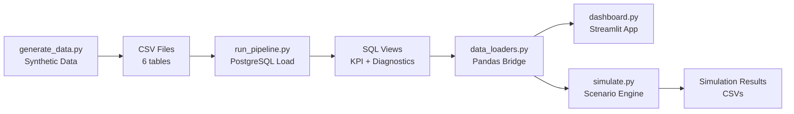

# Profitability Diagnostics — Full Breakdown & Analysis

## 1. What Is This Project?

This is an **end-to-end profitability diagnostic** for a fictional e-commerce retailer called **Apex Global**. The central business question:

> **Revenue is growing, but margins are shrinking. Where is Apex Global leaking value?**

The project generates synthetic data with intentionally embedded profit leaks, loads it into PostgreSQL, runs SQL diagnostics, simulates interventions (discount caps, marketing reallocation), and serves results through a Streamlit dashboard.

---

## 2. Project Architecture

### File Inventory

| Layer | Files | Purpose |
|-------|-------|---------|
| **Data Generation** | [generate_data.py](../src/generate_data.py) | Creates 6 tables + validation files with embedded business story |
| **Database Schema** | [01_schema.sql](../sql/01_schema.sql) | PostgreSQL DDL with constraints and indexes |
| **CSV Loading** | [02_load_csv.sql](../sql/02_load_csv.sql) | COPY commands for CSV → Postgres |
| **KPI Views** | [03_kpi_views.sql](../sql/03_kpi_views.sql) | 11 reusable views — the analytical backbone |
| **Diagnostic Queries** | [04_diagnostic_queries.sql](../sql/04_diagnostic_queries.sql) | Ad-hoc investigative queries for each hypothesis |
| **Extra Views** | [05_extra_diagnostic_views.sql](../sql/05_extra_diagnostic_views.sql) | Segment × discount and region × discount breakdowns |
| **DB Connection** | [db.py](../src/db.py) | Singleton SQLAlchemy engine via DATABASE_URL |
| **Data Loaders** | [data_loaders.py](../src/data_loaders.py) | View → DataFrame bridge with Streamlit cache + CSV fallback |
| **Simulation** | [simulate.py](../src/simulate.py) | Discount cap + marketing reallocation scenario engine |
| **Dashboard** | [dashboard.py](../src/dashboard.py) | Streamlit app: Overview, Diagnostics, Scenario Lab, Scenario Intelligence |
| **Pipeline Runner** | [run_pipeline.py](../scripts/run_pipeline.py) | Orchestrates schema → load → views → diagnostics → export |
| **Blueprint** | [investigation_blueprint.md](investigation_blueprint.md) | Business framing, hypotheses, investigation plan |

---

## 3. The Data

### Scale

| Table | Records |
|-------|---------|
| `customers` | 4,000 |
| `products` | 120 |
| `orders` | 18,186 |
| `order_items` | 30,271 |
| `fulfillment` | 18,186 |
| `marketing_spend` | 72 (18 months × 4 channels) |

### Key Dimensions

- **4 Regions**: Metro (42%), Suburban (30%), Rural (18%), Remote (10%)
- **3 Segments**: Retail (68%), Corporate (22%), Wholesale (10%)
- **4 Channels**: Organic (30%), Paid Social (34%), Email (20%), Referral (16%)
- **4 Product Categories**: Electronics, Apparel, Home, Sports — with 3 subcategories each
- **4 Discount Bands**: No Discount, Low (5-10%), Mid (10-20%), High (22-40%)

### Intentionally Embedded Business Story

The data generator **deliberately** builds two competing profit leaks:

1. **Discount escalation** — the proportion of High-discount orders grows from ~10% early to ~28% late in the 18-month window
2. **Paid Social customer quality** — Paid Social customers get high CAC ($62 avg), weak repeat behavior (0.52× weight), and are funneled into High discounts (40% chance vs ~10% for others)

---

## 4. The Data Findings (From Actual Outputs)

### 4A. Headline: Revenue Up, Margins Down ✅ Confirmed

| Period | Net Revenue | Net Margin |
|--------|-------------|------------|
| First 3 months (Jan–Mar 2024) | $375K–$438K/mo | **26.8–27.1%** |
| Last 3 months (Apr–Jun 2025) | $786K–$811K/mo | **22.6–23.8%** |

- Revenue roughly **doubled** (+99% growth)
- Net margin fell from **~27% → ~23%**, a **4+ point decline**
- Gross margin also eroded: 33.8% → 29.8%

> [!IMPORTANT]
> The margin erosion is real and accelerating. The last month (Jun 2025) hit the worst net margin of the entire period at **22.59%**.

---

### 4B. Leak #1: Discount Cannibalization 🔴 Major

| Discount Band | Orders | Net Revenue | Net Margin |
|---------------|--------|-------------|------------|
| No Discount | 4,793 | $3.14M | **35.78%** |
| Low (5–10%) | 4,536 | $2.73M | **30.23%** |
| Mid (10–20%) | 4,518 | $2.52M | **23.22%** |
| High (22–40%) | 4,339 | $1.98M | **1.93%** |

> [!CAUTION]
> **High-discount orders are nearly unprofitable.** At 1.93% net margin, they contribute just $38K in profit on $1.98M revenue. These 4,339 orders generated $892K in discount giveaways — roughly **23× their profit contribution**. And their share is growing month over month.

---

### 4C. Leak #2: Paid Social CAC/LTV Imbalance 🔴 Major

| Channel | Customers | Avg CAC | Avg LTV | LTV:CAC | Repeat Rate |
|---------|-----------|---------|---------|---------|-------------|
| Organic | 1,221 | $8.19 | $824.50 | **100.68** | 76.0% |
| Email | 778 | $18.03 | $938.46 | **52.06** | 78.0% |
| Referral | 648 | $23.91 | $1,027.49 | **42.97** | 76.4% |
| **Paid Social** | **1,353** | **$63.48** | **$125.89** | **1.98** | **52.0%** |

> [!CAUTION]
> **Paid Social is catastrophically inefficient.** It's the largest customer channel (1,353 customers, 34% of base) but produces an LTV:CAC ratio of **1.98** — barely breaking even on acquisition cost. By contrast, Organic returns **100× on CAC**, Email **52×**, and Referral **43×**. Paid Social customers also have the lowest repeat rate (52% vs 76–78% for others) and are disproportionately funneled into high-discount orders.

---

### 4D. Leak #3: Logistics Subsidization 🟡 Significant

| Region | Orders | Shipping Charged | Actual Cost | **Shipping Deficit** | Net Margin |
|--------|--------|-----------------|-------------|---------------------|------------|
| Metro | 7,457 | $34.5K | $127.9K | **-$93.3K** | 25.28% |
| Suburban | 5,621 | $29.5K | $107.6K | **-$78.1K** | 25.64% |
| Rural | 3,345 | $19.3K | $85.6K | **-$66.3K** | 23.92% |
| Remote | 1,763 | $11.4K | $76.0K | **-$64.6K** | 21.76% |

> [!WARNING]
> **Every region runs a shipping deficit** — totaling **-$302K** across the dataset. Remote is the worst per-order (avg actual cost ~$43 vs ~$6.40 charged), but Metro's massive volume makes it the largest absolute deficit at -$93K. Free shipping on High-discount orders amplifies this.

---

### 4E. Leak #4: Return Rate Trap 🟡 Moderate

| Subcategory | Return Rate | Net Revenue | Notes |
|-------------|-------------|-------------|-------|
| **Luxury Apparel** | **33.4%** | $629K | Highest return rate — 1 in 3 units comes back |
| Footwear | 27.8% | $785K | |
| Everyday Apparel | 26.8% | $769K | |
| Premium Electronics | 20.1% | $1.72M | High revenue, but returns erode margin |
| Budget Electronics | 18.9% | $1.31M | Already thin margins (13.6% gross) + returns |
| Home/Sports | 10–14% | — | Healthy return rates |

> [!NOTE]
> Returns are a real but secondary leak. Luxury Apparel and Footwear have the highest return rates but still contribute positive profit. The bigger danger is **Budget Electronics** — already the thinnest margin subcategory (gross margin implied ~13.6%) combined with 19% returns.

---

### 4F. Worst-Performing Segments (Prioritization Helper)

The **14 segment combinations** that are actually **losing money**:

| # | Segment | Channel | Region | Discount | Orders | Profit |
|---|---------|---------|--------|----------|--------|--------|
| 1 | Retail | Paid Social | Metro | High | 406 | **-$14,311** |
| 2 | Retail | Paid Social | Rural | High | 197 | -$9,875 |
| 3 | Retail | Paid Social | Suburban | High | 246 | -$8,626 |
| 4 | Corporate | Paid Social | Metro | High | 128 | -$5,941 |
| 5 | Corporate | Paid Social | Suburban | High | 80 | -$3,371 |

> [!IMPORTANT]
> **Every single loss-making combination involves Paid Social + High Discount.** The pattern is crystal clear: the intersection of Paid Social customers and High discounts is where the company actively destroys value.

---

## 5. Simulation Results

Three scenarios were run via the dashboard:

| Scenario | Discount Cap | Paid Social Shift | Δ Profit | Δ Margin |
|----------|-------------|-------------------|----------|----------|
| 15% cap + 50% shift | 15% | 50% → Org/Email/Ref | **+$499K** | +3.46 pts |
| **8% cap + 50% shift** | **8%** | **50% → Org/Email/Ref** | **+$884K** | **+5.91 pts** |
| 9% cap + 35% shift | 9% | 35% → Org/Email/Ref | +$817K | +5.49 pts |

> [!TIP]
> The most aggressive scenario (8% discount cap + 50% Paid Social reallocation) recovers nearly **$884K in additional profit** and lifts net margin from 24.8% to 30.7%. Even the conservative 15% cap scenario recovers ~$500K. These are directional — the simulation reprices historical orders, not a forecast of demand response.

---

## 6. Code Quality Assessment

### Strengths 💪

| Area | Assessment |
|------|------------|
| **Data generation** | Sophisticated: configurable, seeded RNG, intentional business story, proper validation |
| **SQL layer** | Excellent: clean DDL with constraints/indexes, cascading view architecture, consistent profit formula |
| **Simulation engine** | Well-documented, transparent about limitations (e.g., not a demand forecast), cohort-based LTV/CAC model with trailing-average fallback |
| **Data loaders** | Smart: Streamlit cache integration + CSV fallback for offline work |
| **Investigation blueprint** | Outstanding strategic document — defines the "why" before the "how" |
| **Separation of concerns** | Clean: data gen → SQL → loaders → dashboard/sim are independent |

### Gaps & Issues ⚠️

| Area | Issue |
|------|-------|
| **Notebooks** | Empty — the EDA/modeling notebooks referenced in the blueprint don't exist yet |
| **Dashboard** | Functional but minimal Plotly styling, no responsive design, missing the segment-level breakdowns |
| **Missing analysis** | No regression model, no random forest feature importance, no cohort analysis — Steps 6-7 from the blueprint |
| **requirements.txt** | Incomplete — only lists pandas, numpy, sqlalchemy, psycopg. Missing streamlit, plotly, and any ML packages |
| **Debug artifacts** | `debug-4e1194.log` (20KB) and agent logging in `run_pipeline.py` are development artifacts that should be cleaned up |
| **Executive summary** | Not yet written — a planned deliverable still pending |
| **No tests** | `test_connection.py` is a DB connectivity check, not a test suite. No unit tests for the data generator or simulation |
| **`02_load_csv.sql`** | Referenced but likely redundant since `run_pipeline.py` handles CSV loading programmatically |
| **`05_extra_diagnostic_views.sql`** | Not included in the pipeline runner's SQL_STEPS — would need manual execution or pipeline update |

---

## 7. Key Takeaways

### For the Business (Apex Global)

1. **Stop subsidizing Paid Social with High discounts.** Every Paid Social + High-discount combination is loss-making. A 15% discount cap alone recovers ~$500K.

2. **Reallocate marketing budget.** Paid Social's LTV:CAC of 2.0× vs Organic's 100× means every dollar shifted creates dramatically more customer lifetime value.

3. **Fix the shipping model.** $302K in total shipping subsidies means the company loses money on fulfillment before even considering product margins. Remote region orders are particularly subsidized.

4. **Watch Luxury Apparel and Budget Electronics.** High return rates (33%) on apparel and thin margins on budget electronics make these categories margin traps.

### For the Project Itself

1. **Phase 2 is solidly done.** Data generation, SQL analytics, simulation engine, and a working dashboard are all functional.

2. **Phase 3 priorities should be:**
   - Build the EDA notebooks with regression + feature importance (Blueprint Steps 7-8)
   - Write the executive summary and technical report
   - Polish the dashboard (better styling, the segment-level drilldowns, embed the simulation results visually)
   - Fix `requirements.txt` to include all actual dependencies
   - Clean up debug artifacts

3. **The simulation proves interventions work.** Even a conservative scenario (15% cap) shows a meaningful profit recovery. This makes the project's recommendation layer credible.

4. **The codebase is well-structured** — clean separation between data, SQL, Python, and presentation layers. The investigation blueprint is unusually thoughtful for a data project.
